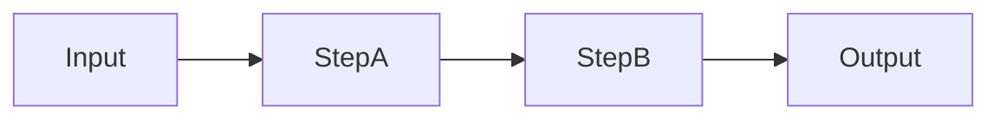

# Chapter <NN> — <Pattern Name>

> Book: *Agentic Design Patterns* (Antonio Gulli), Chapter <NN>. Implemented with Microsoft Agent Framework (C#) on Microsoft Foundry.

## The Pattern in One Paragraph
<Problem it solves, core idea, 2–4 sentences.>



## What This Demo Shows
| Variant | Source notebook | MAF / Foundry building blocks | What to observe |
|---|---|---|---|
| <name> (MAF) | `Chapter_<NN>_...ipynb` | `...` | ... |
| <name> (Foundry-native, optional) | same | hosted agent / Agent Service `...` | ... — or "not applicable because ..." |

## Setup
1. Prerequisites: .NET 10 SDK, a Foundry project with a model deployment and its API key.
2. For local runs, configure shared user-secrets once (shared by all chapters) — see [dotnet/README.md](../../README.md).
3. For cloud-agent validation, document the GitHub Actions path: the repo's `live-foundry-tests.yml` workflow uses the protected `foundry-integration` environment and `Foundry__*` environment variables sourced from GitHub environment secrets.
4. Foundry-native variant only: <extra steps, e.g. `az login`, deploy hosted agent>.
5. Run locally:
   ```powershell
   dotnet run --project dotnet/src/Chapter<NN>.<PatternName>          # all variants
   dotnet run --project dotnet/src/Chapter<NN>.<PatternName> -- A     # single variant
   ```
6. Validate in GitHub Actions when local secrets are unavailable:
   - Open **Actions** → **Live Foundry smoke tests**
   - Run the workflow manually after the workflow file exists on the default branch
   - Optionally pass a deployment alias such as `fast` or `quality`

## Notebook → C# Mapping
| Python (LangChain/ADK/...) | C# (MAF) |
|---|---|
| ... | ... |

## When to Use
- ...

## When NOT to Use
- ...

## Real-World Scenarios
1. **<Domain>** — <concrete flow, why this pattern fits>.
2. ...
3. ...

## Extending with Microsoft Foundry
- <Tracing / evaluations / Agent Service / Foundry Local / Content Safety — what and why>

## Risks & Limitations
- <From ai-research: e.g. latency, error propagation, cost>
