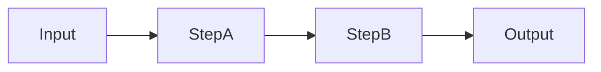

# Chapter <NN> — <Pattern Name>

> Book: *Agentic Design Patterns* (Antonio Gulli), Chapter <NN>. Implemented with Microsoft Agent Framework (C#) on Microsoft Foundry.

## The Pattern in One Paragraph
<Problem it solves, core idea, 2–4 sentences.>


```mermaid
flowchart LR
    Input --> StepA --> StepB --> Output
```

## What This Demo Shows
| Variant | Source notebook | MAF / Foundry building blocks | What to observe |
|---|---|---|---|
| <name> (MAF) | `Chapter_<NN>_...ipynb` | `...` | ... |
| <name> (Foundry-native, optional) | same | Distinct Foundry tool / workflow / evaluation capability | ... — or "not applicable because ..."; do not count merely hosting the existing MAF code. |
| Hosted companion (when suitable) | same | Existing MAF workflow + Foundry protocol host | Link `../Chapter<NN>.<PatternName>.Hosted/README.md`, or state the concrete hosting limitation. Hosting does not imply a separate Foundry-native pattern. |

## Setup
1. Prerequisites: .NET 10 SDK, a Foundry project with a model deployment and its API key.
2. For local runs, configure shared user-secrets once (shared by all chapters) — see [dotnet/README.md](../../README.md).
3. Foundry-native variant only: <additional configuration, credentials, cost/resource side effects>.
4. Run from the repository root:
   ```powershell
   dotnet run --project dotnet\src\Chapter<NN>.<PatternName>          # default
   dotnet run --project dotnet\src\Chapter<NN>.<PatternName> -- A     # single variant
   ```

State the actual default, supported options and costful/opt-in variants. Link the shared
live-test instructions rather than repeating environment-secret setup.

## Where to Look in Code
| File / method | Pattern responsibility |
|---|---|
| [<core method>](<relative-file-path>) | <the small block that implements the pattern> |
| [<variant or contract>](<relative-file-path>) | <what differs and why> |

Use stable file/method pointers, not line numbers that drift during refactoring.

## Notebook → C# Mapping
| Python (LangChain/ADK/...) | C# (MAF) |
|---|---|
| ... | ... |

## When to Use
- ...

## When NOT to Use
- ...

## Real-World Scenarios
1. **<Domain>** — <concrete flow, why this pattern fits>.
2. ...
3. ...

## Extending with Microsoft Foundry
- <Tracing / evaluations / Agent Service / Foundry Local / Content Safety — what and why>

## Hosted Deployment Companion
- Suitability: <supported protocol, dependencies, state/interaction model, or concrete reason for skipping>.
- Project and deployment guide: <link to separate hosted project; preserve the console demo>.
- Request contract: <accepted inputs, final output, conversation behavior, and streaming behavior>.
- Common deployment, authentication/RBAC, packaging, cost and cleanup: [shared hosting guide](../../HOSTING.md).

Keep detailed protocol contracts and service-specific commands in the companion README;
do not repeat the common operational guide in every pattern.

Keep READMEs evergreen and suitable for public sharing. Never include verification reports, deployment status, deployed versions/dates, environment-specific identifiers, invocation results, or evaluation run history. Describe implementation scope and behavior in the relevant sections, not as limitations. Keep resource-removal guidance separate from pattern tradeoffs and scoped to resources the reader owns.

## Tradeoffs
- <Design-pattern tradeoffs from ai-research: e.g. latency, error propagation, cost, model uncertainty. Do not list implementation-specific omissions, package maturity, deployment state, or cleanup tasks.>
