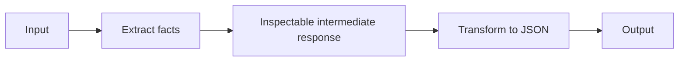

# Chapter 01 — Prompt Chaining

> Book: *Agentic Design Patterns* (Antonio Gulli), Chapter 01. Implemented with Microsoft Agent Framework (C#) and a Microsoft Foundry model deployment.

## The Pattern in One Paragraph

Prompt chaining decomposes a complex request into ordered model steps, where each step produces an intermediate result for the next. It makes transformations easier to inspect and specialize, but each step adds latency and can propagate earlier mistakes.



## What This Demo Shows

| Variant | Source notebook | MAF / Foundry building blocks | What to observe |
|---|---|---|---|
| Technical specifications (`specs`) | `Chapter_01_Prompt_Chaining_(Code_Example).ipynb` | Two `ChatClientAgent`s in an `AgentWorkflowBuilder.BuildSequential` workflow | Extracted CPU, memory, and storage values flow into a JSON formatting step. |
| Market trends (`trends`) | `Chapter_01_Prompt_Chaining_(JSON_Example).ipynb` | Two `ChatClientAgent`s in an `AgentWorkflowBuilder.BuildSequential` workflow | Research evidence is extracted into trends, then transformed into the notebook's JSON shape. The notebook contains only a sample JSON output, not executable prompts or input; the demo supplies evidence corresponding to those sample claims. |
| Foundry-native | Both | Not applicable | Foundry does not provide a separate native prompt-chaining primitive for this scenario; MAF supplies the orchestration while Foundry hosts the model deployment. |

## Setup

1. Prerequisites: .NET 10 SDK and a Microsoft Foundry project with an OpenAI-compatible model deployment and API key.
2. Configure shared user-secrets once; see [the .NET setup guide](../../README.md). Do not put credentials in source files.
3. Run all examples:
   ```powershell
   dotnet run --project dotnet/src/Chapter01.PromptChaining
   ```
4. Run one example:
   ```powershell
   dotnet run --project dotnet/src/Chapter01.PromptChaining -- specs
   dotnet run --project dotnet/src/Chapter01.PromptChaining -- trends
   ```
5. Optionally select a named model deployment configured under `Foundry:ModelDeployments`:
   ```powershell
   dotnet run --project dotnet/src/Chapter01.PromptChaining -- specs --deployment fast
   ```

## Notebook → C# Mapping

| Python notebook element | C# (MAF) |
|---|---|
| `ChatPromptTemplate` extraction prompt | `SpecificationExtractor` / `MarketTrendExtractor` agent instructions |
| `ChatPromptTemplate` transformation prompt | `SpecificationJsonFormatter` / `MarketTrendJsonFormatter` agent instructions |
| LCEL pipe (`prompt → model → parser`) | `AgentWorkflowBuilder.BuildSequential` over two `ChatClientAgent`s |
| Laptop sample input | Same laptop sentence, including 3.5 GHz octa-core CPU, 16 GB RAM, and 1 TB NVMe SSD |
| Trends notebook's JSON sample | JSON shape reproduced from the sample; source data is provided as input because the notebook has no executable prompt or input |
| `StrOutputParser` | Final assistant message text from the workflow output |

## When to Use

- A request has clear stages and each stage can be evaluated independently.
- The input is transformed into an intermediate representation before formatting or generation.
- You need visible, specialized processing steps for extraction, normalization, or document workflows.

## When NOT to Use

- The task is simple enough for one model call; extra steps add cost and latency without useful control.
- The stages are independent and could be evaluated or executed in parallel.
- A later stage cannot validate or correct errors introduced by an earlier stage.

## Real-World Scenarios

1. **Document intake** — extract named fields from contracts, then normalize them into a downstream JSON schema.
2. **Customer support** — classify a request, then draft a response using the selected category and extracted facts.
3. **Market research** — identify evidence-backed trends from source notes, then emit a consistent reporting structure.
4. **Data migration** — interpret legacy records, then map fields into a target representation for deterministic validation.

## Extending with Microsoft Foundry

- Add tracing to observe each agent invocation, token usage, latency, and failures.
- Evaluate extraction fidelity and JSON validity against representative examples before changing prompts or deployments.
- Use Foundry's structured-output support or a deterministic JSON/schema validator for stronger output guarantees when the deployment supports it.

## Risks & Limitations

- The calls execute serially, so latency and token use increase with each stage.
- Later steps receive model-generated intermediate text; extraction errors or omissions can propagate.
- The output format is requested in the prompt, not validated against a schema in this teaching demo.
- The market-trends notebook contains only an output example, so its source input and extraction prompt cannot be ported exactly.
- Agent Framework APIs and package versions may evolve; this project pins the versions used for the current implementation.
- The workflow is awaited as a whole; it prints completed agent responses afterward rather than streaming tokens.
