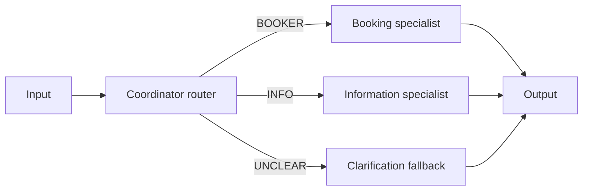
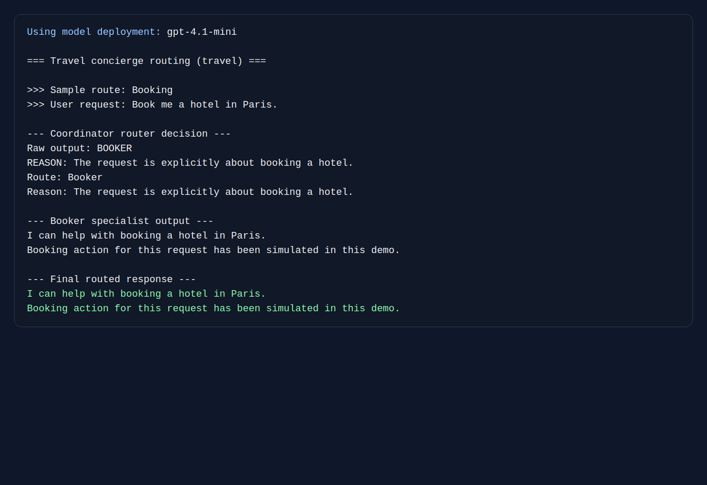
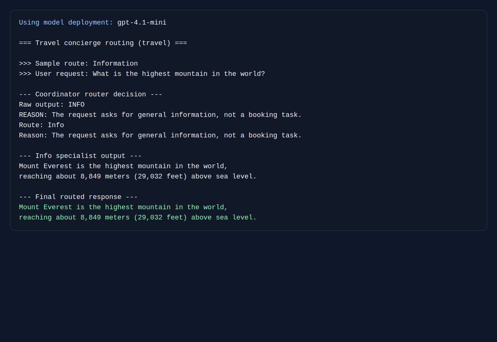

# Chapter 02 — Routing

> Book: *Agentic Design Patterns* (Antonio Gulli), Chapter 02. Implemented with Microsoft Agent Framework (C#) and a Microsoft Foundry model deployment.

## The Pattern in One Paragraph

Routing sends a request to the most appropriate specialist instead of asking one general-purpose agent to handle everything. It improves clarity, control, and extensibility when different requests need different prompts, tools, or model behaviors, but it also adds a classification step that can misroute ambiguous inputs.



## What This Demo Shows

| Variant | Source notebook | MAF / Foundry building blocks | What to observe |
|---|---|---|---|
| Travel concierge (`travel`) | `Chapter_02_Routing_(Google_ADK).ipynb`, `Chapter_02_Routing_(LangGraph).ipynb` | `WorkflowBuilder` conditional edges, `Executor<,>`, `ChatClientAgent`, `InProcessExecution.RunAsync` | The coordinator emits a discrete route, then the workflow forwards the original request to the booking, information, or fallback path. |
| Foundry-native | `Chapter_02_Routing_(Openrouter).ipynb` | Not applicable | The OpenRouter notebook is only a provider request example, not a separate routing primitive. Foundry hosts the model deployment, while MAF provides the routing workflow. |

## Screenshots

Representative console output for the booking and information branches:

### Booking route



### Information route



## Setup

1. Prerequisites: .NET 10 SDK and a Microsoft Foundry project with an OpenAI-compatible model deployment and API key.
2. Configure shared user-secrets once; see [the .NET setup guide](../../README.md). Do not put credentials in source files.
3. Run all examples:
   ```powershell
   dotnet run --project dotnet/src/Chapter02.Routing
   ```
4. Run the routing demo directly:
   ```powershell
   dotnet run --project dotnet/src/Chapter02.Routing -- travel
   ```
5. Optionally select a named deployment configured under `Foundry:ModelDeployments`:
   ```powershell
   dotnet run --project dotnet/src/Chapter02.Routing -- travel --deployment fast
   ```

## Notebook → C# Mapping

| Python notebook element | C# (MAF) |
|---|---|
| ADK coordinator instructions with `sub_agents` | `CoordinatorRouter` `ChatClientAgent` hosted inside `RouterExecutor` |
| LangGraph router prompt returning `booker`, `info`, or `unclear` | Router prompt returns `BOOKER`, `INFO`, or `UNCLEAR`, then `WorkflowBuilder.AddEdge` conditions branch on the parsed enum |
| `RunnableBranch` routing | Conditional workflow edges from `RouterExecutor` to specialist executors |
| Booking specialist / info specialist | `Booker` and `Info` `ChatClientAgent`s |
| Default branch for unmatched requests | `ClarificationExecutor` yields a deterministic clarification message |
| OpenRouter per-request model selection | Not ported as a separate demo because the notebook does not contain routing logic |

## When to Use

- Different request categories need different instructions, tools, permissions, or downstream actions.
- You want visible route decisions before specialist execution.
- Ambiguous requests can be handled safely with a fallback branch instead of forcing one answer path.

## When NOT to Use

- One model prompt can already solve the task reliably without specialist separation.
- The only difference between branches is wording or persona rather than real capabilities.
- Misrouting risk is unacceptable and you do not have strong fallback or verification logic.

## Real-World Scenarios

1. **Travel operations** — route booking changes to reservation automation while routing destination questions to an information assistant.
2. **Customer support triage** — send billing issues, troubleshooting, and policy questions to different handlers with different tools.
3. **Healthcare intake** — separate scheduling questions from general education requests and from ambiguous cases requiring clarification.
4. **Developer portals** — route API reference questions to a docs assistant and incident reports to an escalation workflow.
5. **FinOps help desks** — route spend explanation requests differently from requests that require action on reserved capacity or budgets.

## Extending with Microsoft Foundry

- Use Foundry tracing to record route decisions, latency, and specialist outputs for later review.
- Configure named deployments under `Foundry:ModelDeployments` to experiment with cost-aware or quality-aware model routing behind the same workflow.
- Add Foundry evaluations to measure routing accuracy against a labeled request set before changing prompts or model deployments.

## Risks & Limitations

- The first routing step adds latency and can misclassify borderline requests.
- The notebook scenario is intentionally simple; real systems usually need stronger validation, better fallback handling, and route observability.
- This teaching demo routes with one coordinator prompt and does not include an independent route verifier.
- The OpenRouter notebook for this chapter is only an API usage snippet, so it does not become its own MAF demo variant.
- Agent Framework APIs and package versions may evolve; this project pins the versions used for the current implementation.
